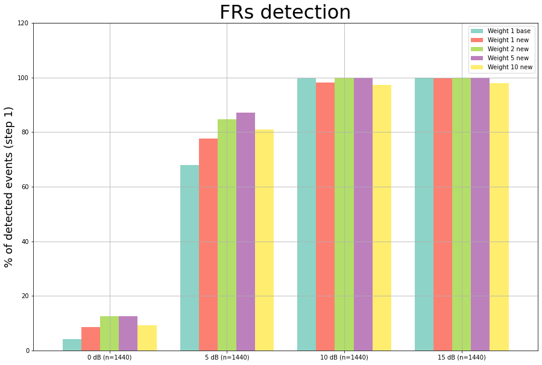
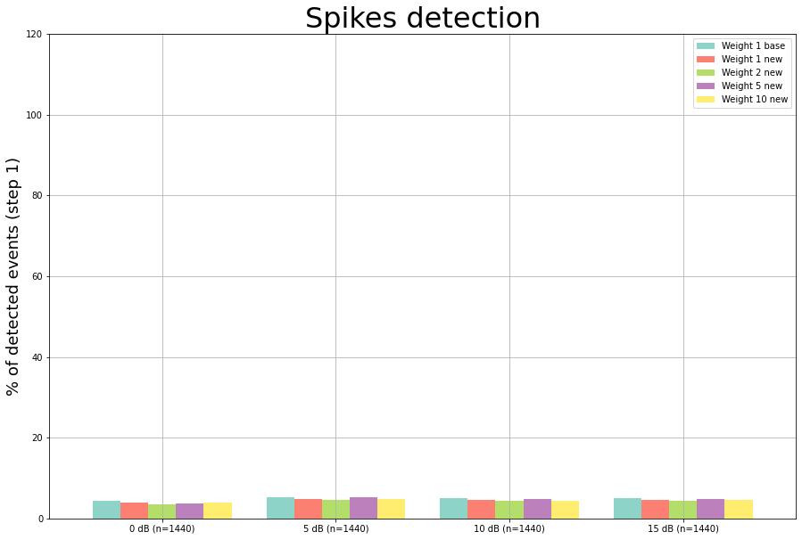

# Halyzia© / Ladybird Neural Network - Impact of class weights

## 📄 Description
Halyzia©, also known as Ladybird, is a sophisticated software designed for the automatic detection of fast-ripples (FRs) in epilepsy, as described in the [doctoral thesis of L. Gardy](http://thesesups.ups-tlse.fr/5164/1/2021TOU30190.pdf) and patented under [Brevet: FR3128111](https://data.inpi.fr/brevets/FR3128111). This repository showcases a component of Halyzia© that is focused on the efficient automatic detection of Fast Ripples (FR) in epilepsy.

Depending on the amount of data to be analyzed, it may be interesting to vary the performance of the model, by varying the ratio between omissions and false positives. The more time we have to process the results, the less we will be constrained on false positives. The reduction of false positives generally goes hand in hand with a reduction of omissions. Conversely, the less time user has, the less time he will accept to sort out false positives, often at the cost of an increase in the number of omissions.

In a training set, the data of class 1 (e.g. FR) and class 2 (e.g. non-FR) can be balanced or not. In the reality of an EEG recording, the proportion of non-FR signal is obviously largely dominant. To account for this phenomenon, we trained several models by assigning an increasingly strong weight to the non-FR class. 

As shown in data tables in this repository ([main/markers_spike](https://github.com/LudovicGardy/halyzia_CNN_weights/tree/main/markers_spike)), false positives are almost always found on the same recording channels (GPH'2), as if they carry high frequencies that impact the detection, without this effect being caused by the spikes directly. Indeed, identical spikes on other recording channels are not detected.

## ⚒️ Installation

### Prerequisites
- Python 3.11
- Python libraries
    ```sh
    pip install -r requirements.txt
    ```

## 📝 Usage
Detailed analysis can be accessed and performed from [main.ipynb](https://github.com/LudovicGardy/halyzia_CNN_weights/blob/main/main.ipynb).

### Input data
- markers_FR: Fast Ripples detected in the EEG [1] [5]
- markers_spike: Epileptic Spikes detected in the EEG [1] [5]

### Results

#### CNN performance on Fast Ripples
The model was evaluated on open source data [see ref. 1] containing 5760 Fast Ripples at different signal to noise ratios: 0, 5, 10 and 15 dB (1440 events per category).


#### CNN performance on non-FRs
The model was evaluated on open source data [see ref. 1] containing 5760 Spikes (non-FR) at different signal to noise ratios: 0, 5, 10 and 15 dB (1440 events per category).


## 📚 References
[1] Roehri, N., Pizzo, F., Bartolomei, F., Wendling, F., & Bénar, C. G. (2017a). What are the assets and weaknesses of HFO detectors? A benchmark framework based on realistic simulations. PLoS ONE, 12(4). https://doi.org/10.1371/journal.pone.0174702

[2] Cohen M.X. Analyzing Neural Time Series Data: Theory and Practice, Cambridge, MA, USA:MIT Press, 2014.

[3] Roehri, N., & G, B. C. (2017b). A New Hope for HFO representation: the ZH0 time-frequency normalization Modeling variability of brain electrical activity View project Characterizing and modeling the neurovascular coupling for interictal spikes View project A New Hope for HFO representation: the ZH0 time-frequency normalization. Journal of Neuroscience Methods, 130(9), 118–126. https://doi.org/10.13140/RG.2.2.19375.74406

[4] Roehri, N., Lina, J.-M., Mosher, J. C., Bartolomei, F., and Benar, C.-G. (2016). Time-frequency strategies for increasing high-frequency oscillation detectability in intracerebral eeg. IEEE Transactions on Biomedical Engineering, 63(12):2595–2606. https://doi.org/10.1109/TBME.2016.2556425

[5] Gardy L., Barbeau E.J., Hurter C. Automatic Detection of Epileptic Spikes in Intracerebral EEG with Convolutional Kernel Density Estimation. Proceedings of the 15th International Joint Conference on Computer Vision, Imaging and Computer Graphics Theory and Applications - Volume 2 : HUCAPP, pages 101-109, 2020. https://doi.org/10.5220/0008877601010109

## 👤 Author
- LinkedIn: [Ludovic Gardy](https://www.linkedin.com/in/ludovic-gardy/)
- Doctoral thesis: [PDF](http://thesesups.ups-tlse.fr/5164/1/2021TOU30190.pdf)